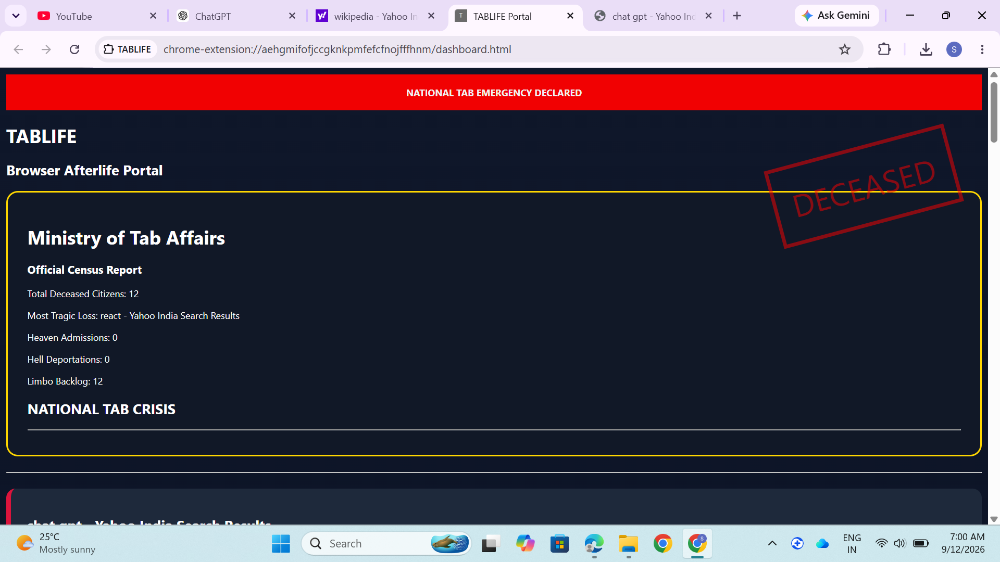
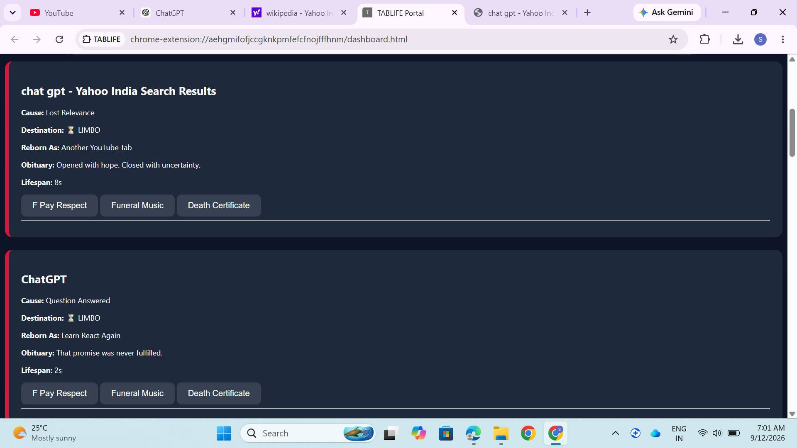

# TABLIFE™ – Browser Afterlife Management System 🎯

## Basic Details

### Team Name:
[KaSha]

### Team Members

- Team Lead: [Amina Shabeeba AM] - [RIT Kottayam]
- Member 2: [Kavitha PR] - [RIT Kottayam]

---

## Project Description

TABLIFE™ is the world's first Browser Afterlife Management System. Instead of letting browser tabs disappear forever after being closed, we provide them with a proper digital afterlife complete with memorial services, death certificates, funeral music, reincarnation records, and official government documentation.

---

## The Problem (that doesn't exist)

Every day, millions of browser tabs are closed without receiving the dignity and respect they deserve. Families never get closure. No funeral is held. No official records are maintained. Browser tabs simply vanish from existence.

This silent digital tragedy has gone unaddressed for far too long.

---

## The Solution (that nobody asked for)

We established the Ministry of Tab Affairs, a fully functional government department dedicated to managing the afterlife of browser tabs.

Whenever a tab dies, TABLIFE™:

- Determines its cause of death
- Assigns it to Heaven, Hell, or Limbo
- Writes an obituary
- Predicts its reincarnation
- Conducts a memorial service
- Plays funeral music
- Issues an official death certificate
- Records everything in the National Tab Graveyard

Because every tab deserves a proper farewell.

---

# Technical Details

## Technologies/Components Used

### For Software

**Languages Used**
- JavaScript
- HTML
- CSS

**Frameworks Used**
- Chrome Extension APIs

**Libraries Used**
- jsPDF

**Tools Used**
- VS Code
- Google Chrome
- GitHub

---

## Implementation

### Installation

```bash
git clone https://github.com/Shabeeba05/TABLIFE.git
```

### Run

1. Open Chrome
2. Go to:

```text
chrome://extensions
```

3. Enable Developer Mode
4. Click Load Unpacked
5. Select the TABLIFE project folder
6. Start honoring fallen browser tabs

---

# Project Documentation

## Screenshots

### Dashboard



*Official Ministry of Tab Affairs dashboard showing national tab mortality statistics.*

---

### Memorial Service



*Conducting a respectful memorial service for a deceased browser tab.*

---

### Death Certificate


*Government-issued Death Certificate generated for a fallen digital citizen.*

---

## Diagrams

### Workflow

![Workflow]

*Closed tab → Cause of Death Analysis → Afterlife Assignment → Memorial Service → Official Documentation.*

---

# Project Demo

## Video

[demo.mp4]

This video demonstrates:

- Detection of tab death
- Tab afterlife classification
- Memorial services
- Funeral music
- Respect payment system
- Official PDF death certificate generation
- National graveyard records

---

## Additional Demos

GitHub Repository:

https://github.com/Shabeeba05/TABLIFE

---

# Team Contributions

### [Amina Shabeeba]
- Chrome Extension Development
- Dashboard Design
- Graveyard System

### [Kavitha]
- Memorial Service System
- Death Certificate Generation
- UI Improvements

### [Both]
- Testing
- Documentation
- Presentation & Demo
